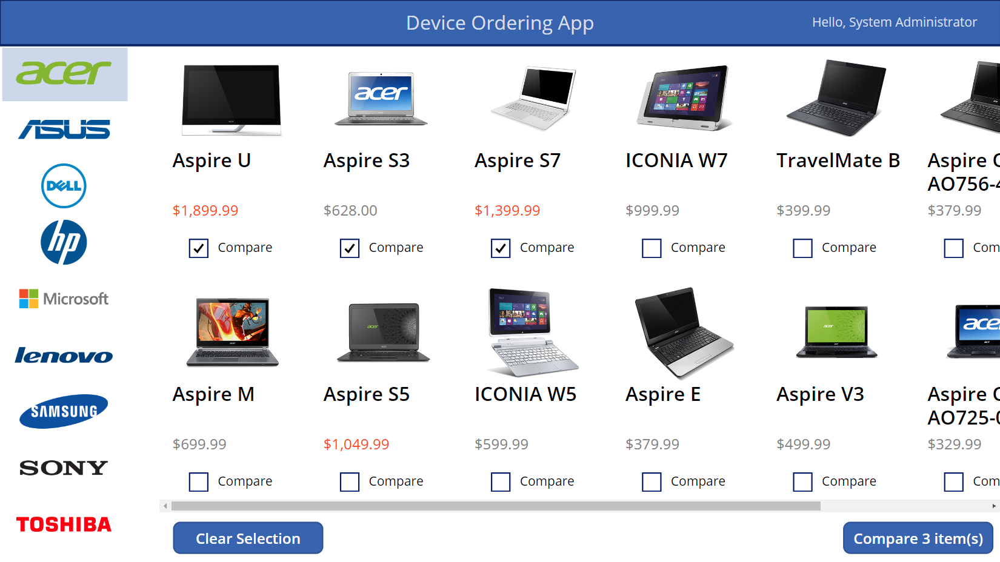
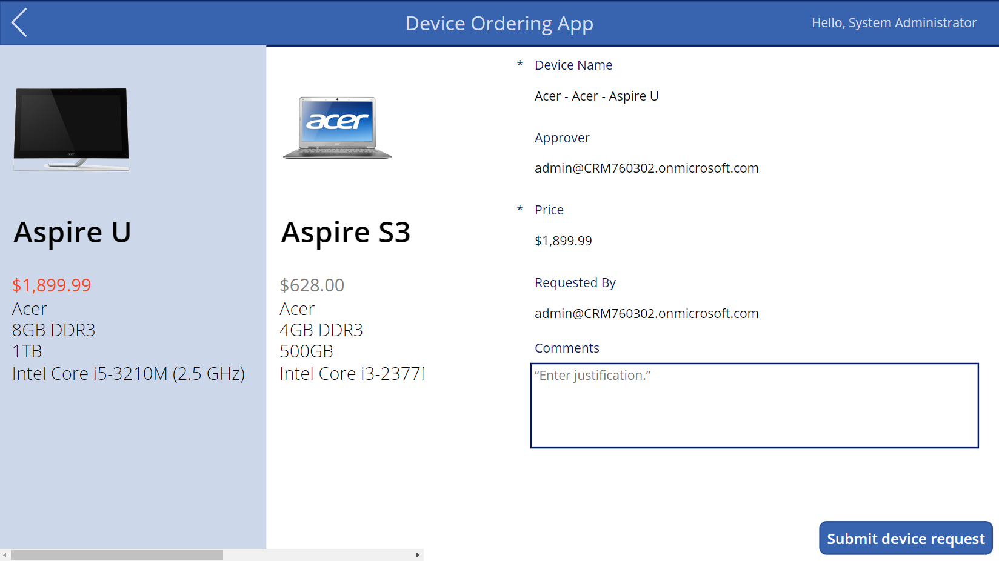
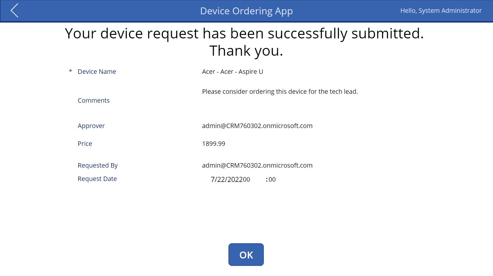

<h4 align="center">
<b>Canvas App built on Power Apps platform.</b> 
 
 ### :muscle: Project
 
Part of HCL's Dynamics 365 Training
 
Designed and built business app from a canvas in Microsoft Power Apps without writing code in a traditional programming language by dragging and dropping elements onto a canvas using Excel-like expressions for specifying logic and working with data. 
The App integrates business data from a wide variety of Microsoft and third-party sources. Easy to share so that users can run it in a browser or on a mobile device, and embed the app so they can run it in SharePoint, Power BI, or Teams.
 

  
  
  

 
</h4>

  
  

 
